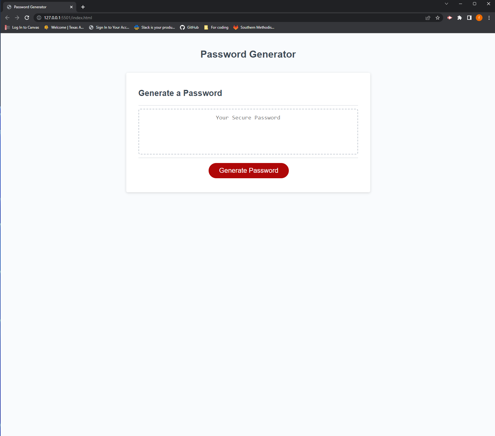

# Password-Generator

## Description

This repository was made to help a new student like myself implement javascript in to html, This homework assignment was also made to push us and challenge us about our knowledge of javascript and implement it into password generator. 

## Installation

N/A

## Usage

This application enables users to generate random passwords based on the criteria that the user had selected.

## Link to Deployed Application 

## License 

N/A

